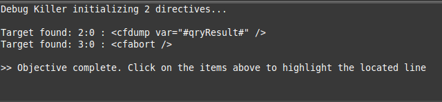

# Sublime Debug Killer
Find debug statements unintentionally left behind in your code. As developers 
and web application builders we sometimes have a need to see more information
in our code and will write debug statements to get what we need. 

Here are some examples in a few languages where you might have debug
statements in code:

```coldfusion
<!-- ColdFusion -->
<cfset qryResult = someDAO.getSomeData(id=12345) />
<cfdump var="#qryResult#" />
<cfabort />
```

```javascript
// JavaScript
resultCallback = function(data) {
   console.log(data);
   if (data.length) {
      // do stuff...
   }
}
```

```php
// PHP
function getData($id) {
   $qryResult = $someDAO.getSomeData($id);
   var_dump($qryResult);
}
```

With this plugin press *CTRL + ALT + K* and you get



For more information visit http://adampresley.github.com/sublime-debugkiller/.

## Change History

* 2013-03-09:
	* Added support for project-based patterns
* 2013-03-08:
	* Initial release

## License
The MIT License (MIT)
Copyright (c) 2013 Adam Presley

Permission is hereby granted, free of charge, to any person obtaining a copy of this software and associated documentation files (the "Software"), 
to deal in the Software without restriction, including without limitation the rights to use, copy, modify, merge, publish, distribute, sublicense, 
and/or sell copies of the Software, and to permit persons to whom the Software is furnished to do so, subject to the following conditions:

The above copyright notice and this permission notice shall be included in all copies or substantial portions of the Software.

THE SOFTWARE IS PROVIDED "AS IS", WITHOUT WARRANTY OF ANY KIND, EXPRESS OR IMPLIED, INCLUDING BUT NOT LIMITED TO THE WARRANTIES OF MERCHANTABILITY, 
FITNESS FOR A PARTICULAR PURPOSE AND NONINFRINGEMENT. IN NO EVENT SHALL THE AUTHORS OR COPYRIGHT HOLDERS BE LIABLE FOR ANY CLAIM, DAMAGES OR OTHER 
LIABILITY, WHETHER IN AN ACTION OF CONTRACT, TORT OR OTHERWISE, ARISING FROM, OUT OF OR IN CONNECTION WITH THE SOFTWARE OR THE USE OR OTHER DEALINGS 
IN THE SOFTWARE.